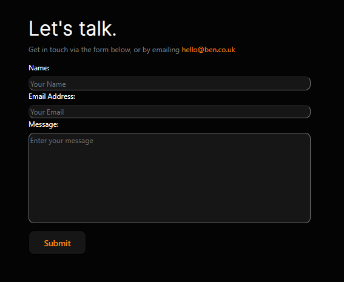

## Benjaman Green - Portfolio
[View Live Project Here](https://burakkuboido.github.io/Benjaman-Green/)

This websites' sole purpose is to be used by employers to seek out my individual skills and talents through the use of searching through my previous work. Giving employers a view into my mindset as well as being able to reach out to me via a form. Additionally, it also gives the employer a chance to get to know a little about myself before deciding whether or not to reach out to me.

Each page plays its own part in getting the employer to decide to reach out to me. Each page will be explained more in depth.

## User Experience (UX)

- ### User Stories

    - #### First Time Visiting Goals

        As a first time visitor, I want to understand multiple aspects of the website. 

        What's the purpose.
        How easilly can I navigate.
        How I can contact the developer of the website.
        Is all the information I need on that website.

    - #### Returning Vistior Goals
        As a returning visitor, I want to see if their information is up to date as well as if their are any updates on their latest projects/work.

    - #### Frequent Visitor Goals
        In terms of frequent visitor goals, I don't have any as employers wouldn't keep looking at my portfolio. However, in terms of friends and family, I would want them to be able to see what I am getting up to lately to see how far I have progressed in my career.

- ### Design

    - #### Colour Scheme

        When working on the design aspect of my website, I wanted to create a website that showcases my personality without having to say too much. I wanted it to give the users the thought "Why Black?". I wanted to keep myself a mystery whilst giving them enough information about myself to be able to coem to the conclusion to hire me.

        I know I wanted a sleek design so a small mix of typography would contrast well with the background. Using a vivid orange for links made it so that it would stand out amongst the rest of the text on the webpage so the user knew what a link would be if they were more interested into a particular section of the website. Additionally, the white text made it clear to read, helping people with poor eyesight be able to read amongst the dark background.

        Making sure the website was easy to navigate was one of the first time visting goals for the users. Making them want to read more.

    - #### Typography

        Having a mix of fonts was hard to keep up with as I needed to make sure each font worked with each other, even if they are on seperate pages. Using Roboto, made the front page and the work page bold, sleek and clear to read. Using Raleway for the about page made it a by luxurious, making it come across as I know what I am doing. Lastly, I used inter for the contact page to keep it simple, as if I wanted to have a casual chat, which works well with the contact form. 

    - #### Imagery

        The hero image on the several pages were used to showcase myself. However, at this moment, It is solely used as a placeholder for a profgessioanl photo of myself in the future. How the photo is, is how I would create a photo of myself and replace it with the placeholder.

        Images that are used on the work page are from my previous projects that I have worked on from university. The resolution could be better in these photos but this was because they were not taken as screenshots. Instead, I used a google chrome extension; GoFullPage, to be able to take a screenshot of the entire page, instead of one peice off it. I wanted to make sure I could show off the entire webpage at the best of my ability, however I have learnt from this. In the future, it's best to keep it simple and only had a few screenshots and maybe include a link to the webpage. Since these websites were not hosted at the time, I will need to put them onto GitHub to be able to host them for future projects/examples.

    - #### Wireframes

        I regret to say that I have no wireframes. I was short on time due to multiple aspects of my life getting in the way of working on my project, so I decided to skip the wireframe part and made sure my website was complete. This took a toll on the overall design of my website as it took longer to implement the features I wanted, additionally it took extra time to figure out what fonts I needed and where to place the containers/sections of the website.

## Features

-   Responsive on all device sizes:
    - Mobile: [Home](assets/css/images/Mobile_Home.png) | [About](assets/css/images/Mobile_About.png) | [Work](assets/css/images/Mobile_Work.png) | [Contact](assets/css/images/Mobile_Contact.png)
    - Tablet: [Home](assets/css/images/Tablet_Home.png) | [About](assets/css/images/Tablet_About-screenshot.png) | [Work](assets/css/images/Mobile_Work.png) | [Contact](assets/css/images/Tablet_Contact.png)
    - Desktop: [Home](assets/css/images/Desktop_Home.png) | [About](assets/css/images/Desktop_About.png) | [Work](assets/css/images/Mobile_Work.png) | [Contact](assets/css/images/Desktop_Contact.png)

-   Interactive Elements:

    - Nav Bar:
    In the top left of the website, a navigation bar can be seen. To increase accessibility, I have made it so that not only do the colours stand out, but the user acn tell which page they are currently on due to the colour of the current page name being lit up with an orange colour. Additionally, When a user hovers over a link, it will light up orange to illustrate that it is a link.

    

    - Work Images Modal:
    The work images modal is NOT my own. This was taken from https://www.w3schools.com/howto/howto_css_modal_images.asp thought the images ARE my own work. I needed to increase accessibility so that sight-impaired users could zoom into the image more clearly if they have trouble seeing the images.

    

    - Links To Other Pages Via Text:
    As you can see from the below image, I have made it so that there are links that go to other pages that synergise well with the topic that was being conveyed to the user. For example, in the about page, the about page talks about myself as a person and at the end, it says "let's talk" in a orange colour which illustrate that it is a link, which takes the user to the contact page to be able to reach out to me.

    

    - Form:
    The form part of my website was crucial as I needed a way for employers to be able to reach out to me. Without this, it would render my website futile. It was created with the idea of the users, aka employers, to be able to reach out to me if they are interested in my skills as a web developer/designer.
    

## Technologies Used

### Languages Used

-   [HTML5](https://en.wikipedia.org/wiki/HTML5)
-   [CSS3](https://en.wikipedia.org/wiki/Cascading_Style_Sheets)
-   [JavaScript](https://en.wikipedia.org/wiki/JavaScript)

### Frameworks, Libraries and Programs Used

-   [Bootstrap](https://getbootstrap.com/)
        was used to implement Responsive design more easier, however at the end, I still used media queries.
-   [Font-Awesome](https://fontawesome.com/)
        was used to add the down arrow into my Work page.
-   [Fonts](https://fonts.google.com/)
        were used to import different kinds of fonts into my website.
-   [Git](https://git-scm.com/)
        was used for version control via github. To be able to tell where I have included what and when. This helps to unerstand where problems started to occur.
-   [GitHub](https://github.com/)
        was used to store the projects code after being pushed to Git.

## Testing

The W3C Markup Validator and W3C CSS Validator Services were used to validate every page of the project to ensure there were no syntax errors in the project.

- [W3C Markup Validator](https://validator.w3.org/#validate_by_input) - Results: [Home](assets/css/images/Vali_Home.png) | [About](assets/css/images/Vali_About.png) | [Work](assets/css/images/Vali_Work.png) | [Contact](assets/css/images/Vali_Contact.png) | [CSS](assets/css/images/Vali_CSS.png)

### Testing User Stories from User Experience (UX) Section

- #### First Time Visiting Goals

    1. What's the purpose?
        - "It seems that Bens' website is a portfolio about himself, displaying what he can do for employers. Showcasing his skills in web design."

    2. How easilly can I navigate?
        - "All the links work to my knowledge, I tried on a phone instead of a PC so I'm not sure if there is much difference, but it works. I can get from point A to point B pretty easilly. Everything is easilly labelled."

    3. How I can contact the developer of the website?
        - "There is a form in which I can use, though it brings me to a code institute page, not sure if that is normal but at least the button and the form itself works. There is also an email in which employers can contact him."

    4. Is all the information I need on that website?
        - "There's not much about Bens' standard skills such as teamwork or other jobs he has had, but when it comes to web design, he shows his previous work well. Though, they could be placed better. The zoom in feature when you click it is nice though."

- #### Returning Vistior Goals

    1. Is their information up to date?
        - "As far as I'm aware, all information seems to be up to date. not sure if the email displayed is his email or not. It's hard to tell if the work are up to date or not."
        
    2. Are there any updates on their project work?
        - "It's not like a blog, so I cant tell what is newly added or not, so I think that would be a nice feature to add. To see what exactly he is currently working on and what he has worked on behind the scenes in other projects to this date and in the future."

- #### Frequent Visitor Goals

    1. What has Ben been up to lately?
        - "By the looks off it, working on designing his portfolio."

### Further Testing
- The website was manually tested on a Samsung S8+, Iphone 5/SE, Ipad Air and a PC
- The website was manually tested on Google Chrome
- The website was viewed in Developer tools at all settings of responsiveness. 
- All links clicked and checked.
- Sent the website to a friend to check to see if everything works well on his end.

### Known Bugs (Resolved)
- The WC3 Validator reported back several bugs that I resolved: 
    1. Extra slashes in the headings.
    2. Multiple closing tags were not found and some had extra.
    3. Img had no alt tag.

### Known Bugs (Not Resolved)
- My sign up form doesn't actually submit info because this was outside the scope of the project. 
- Images on the work page are not placed perfectly. They are also hard to see without clicking on them.
- Text was incredibly small on the desktop but big on smaller screens. Should have made it so text was bigger across all devices.
- Was a lot of "white space", needed to fill in some of the gaps.
- Nav text was not centered.

## Credits

### Code
- [Stackoverflow](https://stackoverflow.com/) to remind me what I might be missing in my code for it to not work properly.
- [Bootstrap Display](https://getbootstrap.com/docs/5.2/utilities/display/) to understand more about making certain parts visible to the user.
- [Bootstrap Layout](https://getbootstrap.com/docs/4.0/layout/grid/) to understand how cols and rows work at a more fundamental level.
- [Modal Images](https://www.w3schools.com/howto/howto_css_modal_images.asp) To create a modal for the user to click on an image to make the image bigger.

### Content
- My previous projects were taken from my university account that I no longer have access to due to finishing university. 
- [Code Institute Sampe Readme](https://learn.codeinstitute.net/courses/course-v1:CodeInstitute+CSSE_PAGPPF+2021_Q2/courseware/66cf361c769a41d496f5001fae6f9be7/3b5cd5dc8313462aa5975a3c9b9a1a3c/) for Readme layout. 

### Media
- Image for Banner/Hero Image can be found [here](https://blog.havells.com/category/uncategorized/)